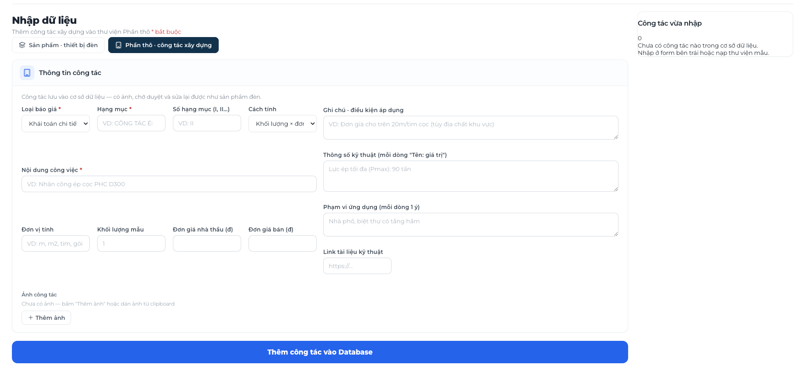

# UpLark Partner CRM — Tài liệu nhập môn nghiệp vụ

> Mục tiêu: giúp người dùng nội bộ và team business hiểu CRM đang quản lý việc gì, dữ liệu liên kết ra sao và mỗi màn hình dùng để làm gì. Tài liệu này tập trung vào nghiệp vụ, không đi vào code hay hạ tầng kỹ thuật.

## 1. CRM là gì?

CRM (Customer Relationship Management) là nơi ghi nhận và điều phối toàn bộ vòng đời làm việc với khách hàng:

```text
Khách hàng → Cơ hội/nhu cầu → Project → Kế hoạch → Công việc → Giờ làm → Chi phí & lợi nhuận → Báo cáo
```

Trong UpLark Partner CRM, CRM không chỉ là danh bạ khách hàng. Nó kết nối ba câu hỏi kinh doanh:

1. **Đang làm cho khách hàng nào?** — Account, Contact, Opportunity.
2. **Đang cam kết kết quả gì?** — Project, Milestone, Stage, Task.
3. **Đang dùng bao nhiêu nguồn lực và có hiệu quả không?** — Team, Timesheet, Budget, Cost, P&L.

## 2. Bốn phạm vi cần nắm

| Phạm vi | Hiểu đơn giản | Kết quả cần có |
| --- | --- | --- |
| **Timesheet** | Ai làm việc gì, vào ngày nào, bao nhiêu giờ | Có số giờ kế hoạch và số giờ thực tế để đối soát |
| **Project Sheet ** | Mỗi project có mục tiêu, tiến độ, thành viên và công việc nào | Biết project đang ở đâu, việc nào trễ hoặc còn thiếu |
| **P&L** | Project thu bao nhiêu, tốn bao nhiêu, còn lợi nhuận bao nhiêu | Biết hiệu quả tài chính theo project |
| **Hồ sơ nhân sự** | Ai thuộc team, vai trò gì, có thể tham gia project nào | Phân công đúng người và theo dõi năng lực/sức chứa |

Bốn phạm vi dùng chung một dữ liệu nền. Ví dụ: Task thuộc Project, có người thực hiện; người đó ghi Timesheet; giờ làm tạo thành Cost; Cost được đưa vào P&L của Project.

## 3. Mô hình dữ liệu cốt lõi

```text
Tenant / Workspace
├── Users / Team members
├── Accounts / Clients
│   └── Contacts
├── Opportunities
└── Projects
    ├── Milestones
    │   └── Stages
    │       └── Tasks
    ├── Project members
    ├── Timeline / Calendar
    ├── Activity / Audit
    ├── Documents
    └── Budget / Cost / P&L
```

### 3.1 Workspace

Workspace là phạm vi dữ liệu của một tổ chức hoặc một nhóm vận hành. Mọi Account, Project, User và báo cáo cần được đọc trong đúng workspace. Không nên kết luận danh sách trống là không có dữ liệu trước khi kiểm tra workspace và bộ lọc.

### 3.2 Account và Contact

- **Account/Client:** công ty hoặc khách hàng tổ chức.
- **Contact:** người liên hệ thuộc Account.
- Một Account có thể có nhiều Contact và nhiều Project.
- Các thông tin thường dùng: tên công ty, mã, owner, trạng thái, tier, lifecycle stage, MRR và health score.

### 3.3 Opportunity

Opportunity là nhu cầu hoặc cơ hội kinh doanh trước khi trở thành Project. Nó giúp Sales theo dõi khả năng chốt, giá trị dự kiến và bước tiếp theo. Khi cơ hội đã được chốt, thông tin cần được chuyển thành phạm vi Project rõ ràng.

### 3.4 Project

Project là một cam kết/kết quả lớn với khách hàng. Project nên trả lời được:

- Làm cho Account nào?
- Mục tiêu hoặc kết quả bàn giao là gì?
- Ai chịu trách nhiệm chính?
- Thời gian, ngân sách và trạng thái hiện tại ra sao?

### 3.5 Milestone, Stage và Task

Đây là cấu trúc từ lớn đến nhỏ:

| Thành phần | Câu hỏi trả lời | Ví dụ |
| --- | --- | --- |
| **Milestone** | Đã đạt một mốc kết quả lớn nào? | Hoàn tất thiết kế UX |
| **Stage** | Trong mốc đó đang qua giai đoạn nào? | Thu thập yêu cầu |
| **Task** | Một người cần làm hành động cụ thể gì? | Phỏng vấn 3 người dùng |

Nguyên tắc: **Project → Milestone → Stage → Task**. Task là đơn vị thực thi nhỏ nhất; task nên có người phụ trách, trạng thái, ưu tiên, ngày bắt đầu/hạn và planned hours.

## 4. Quy trình nghiệp vụ từ đầu đến cuối

### Bước 1 — Ghi nhận khách hàng và nhu cầu

Sales tạo hoặc kiểm tra Account, Contact và Opportunity. Cần tránh tạo trùng khách hàng; nếu khách hàng đã tồn tại thì dùng lại bản ghi đó.

### Bước 2 — Chốt phạm vi Project

Xác định mục tiêu, kết quả bàn giao, phạm vi trong/ngoài, mốc thời gian, ngân sách và người chịu trách nhiệm. Đây là baseline để business, Product và Delivery cùng hiểu một việc.

### Bước 3 — Lập kế hoạch

Tạo Milestone → Stage → Task. Mỗi Task phải có người thực hiện và thời lượng dự kiến. Timeline/Gantt dùng để nhìn thứ tự và sự phụ thuộc giữa các việc.

### Bước 4 — Phân công team

Thêm thành viên vào Project và gán PIC/assignee cho Task. Người được gán cần biết rõ mình chịu trách nhiệm cho đầu việc nào, hoàn thành khi nào và tiêu chí hoàn thành là gì.

### Bước 5 — Thực thi và cập nhật tiến độ

Trong quá trình làm, cập nhật:

- trạng thái Task: **To Do → In Progress → Done**;
- mức ưu tiên: Critical, High, Medium, Low;
- ngày bắt đầu/hạn và planned hours;
- comment, tài liệu hoặc bằng chứng cần thiết;
- rủi ro, hoạt động và thay đổi quan trọng.

### Bước 6 — Ghi nhận Timesheet

Người thực hiện ghi giờ làm thực tế theo Task, ngày làm việc và ghi chú. So sánh planned hours với actual hours để phát hiện:

- việc đang tốn nhiều giờ hơn dự kiến;
- task đã làm nhưng chưa ghi giờ;
- giờ làm bị ghi nhầm người, ngày hoặc project;
- project có nguy cơ vượt nguồn lực.

### Bước 7 — Theo dõi P&L

P&L của Project tối thiểu gồm:

```text
Doanh thu / Income
− Chi phí / Cost
= Lợi nhuận / Profit
```

Chi phí có thể đến từ nhân sự, vendor hoặc khoản chi khác tùy quy ước của doanh nghiệp. P&L chỉ đáng tin khi Project, người làm, giờ làm và mức chi phí được liên kết đúng.

### Bước 8 — Review và đóng Project

Trước khi đóng, Delivery và Business kiểm tra:

- các Task đã hoàn tất hoặc được chuyển sang kế hoạch tiếp theo;
- Timesheet đã đủ và được đối soát;
- tài liệu bàn giao đã có;
- doanh thu, chi phí và lợi nhuận đã được tổng hợp;
- các vấn đề còn tồn tại đã được ghi nhận.

## 5. Mỗi màn hình dùng để làm gì?

| Màn hình | Dùng khi nào | Câu hỏi chính |
| --- | --- | --- |
| **Dashboard** | Xem nhanh tình hình chung | Có bao nhiêu project/task? Lợi nhuận và tiến độ thế nào? |
| **Projects** | Tìm và mở một project | Project nào đang active, planning hoặc completed? |
| **Overview** | Nắm bức tranh của một project | Mục tiêu, milestone, ngân sách, team và hoạt động gần đây là gì? |
| **Tasks** | Điều phối công việc hằng ngày | Việc nào To Do, In Progress, Done? Ai phụ trách? |
| **Timeline** | Xem lịch và mốc bàn giao | Mốc nào diễn ra trước/sau? Việc nào có nguy cơ trễ? |
| **Team** | Xem người tham gia project | Ai đang làm bao nhiêu task và hoàn thành bao nhiêu phần trăm? |
| **Activity** | Xem lịch sử thay đổi | Ai đã làm gì, lúc nào, liên quan task/project nào? |
| **Documents** | Lưu tài liệu dự án | Requirement, Design, Operations, Legal và các bản bàn giao nằm ở đâu? |
| **Clients** | Quản lý Account/khách hàng | Khách hàng đang ở lifecycle nào, owner là ai, sức khỏe ra sao? |
| **Users** | Quản lý người dùng nội bộ | Ai có quyền và thuộc workspace nào? |
| **Calendar** | Xem kế hoạch theo ngày | Hôm nay/tuần này ai có lịch hoặc việc gì? |
| **Timesheet** | Nhập và đối soát giờ làm | Đã làm bao nhiêu giờ so với kế hoạch? |
| **Analytics** | Nhìn xu hướng nguồn lực | Nguồn lực, tải công việc và hiệu quả theo project thay đổi ra sao? |
| **Settings** | Kiểm tra tài khoản và quyền | Mình đang đăng nhập bằng ai, role gì và workspace nào? |

## 6. Vai trò trong vận hành

| Vai trò | Trách nhiệm nghiệp vụ |
| --- | --- |
| **Founder/GM** | Quyết định phạm vi, ưu tiên, quyền và kết quả kinh doanh |
| **Sales Owner** | Quản lý Account, Contact, Opportunity và quan hệ khách hàng |
| **Delivery Lead** | Chịu trách nhiệm kế hoạch, phân công, tiến độ và chất lượng bàn giao |
| **Finance Admin** | Theo dõi ngân sách, doanh thu, chi phí, hóa đơn và P&L |
| **PIC/Assignee** | Thực hiện Task, cập nhật trạng thái và ghi Timesheet |
| **Business/Viewer** | Theo dõi tiến độ, kết quả, rủi ro và báo cáo trong phạm vi được cấp quyền |

Một người có thể có nhiều vai trò, nhưng **quyền xem/sửa dữ liệu** và **người chịu trách nhiệm nghiệp vụ** là hai khái niệm khác nhau.

## 7. Cách đọc một Project trong 5 phút

1. Mở đúng Project và kiểm tra Account, trạng thái, PIC và ngân sách.
2. Vào **Overview** để biết mục tiêu, mốc lớn và hoạt động gần đây.
3. Vào **Tasks** để xem cấu trúc Milestone → Stage → Task.
4. Lọc Task chưa hoàn thành, quá hạn hoặc ưu tiên cao.
5. Vào **Timeline** để xem mốc có trễ không.
6. Vào **Team** để biết ai đang quá tải hoặc chưa được phân công.
7. Vào **Timesheet/Analytics** để so sánh planned hours với actual hours.
8. Vào **P&L** để xem doanh thu, chi phí và lợi nhuận.

## 8. Ví dụ dễ hiểu

Giả sử Account **Khách hàng A** thuê xây dựng webapp CRM:

```text
Account: Khách hàng A
└── Project: Xây dựng webapp CRM
    ├── Milestone: Chốt phạm vi
    │   └── Stage: Phân tích nghiệp vụ
    │       ├── Task: Phỏng vấn Sales
    │       └── Task: Chốt danh sách tính năng pilot
    ├── Milestone: Xây dựng MVP
    │   └── Stage: Phát triển
    │       ├── Task: Làm Project Sheet
    │       └── Task: Làm Timesheet
    └── Milestone: Nghiệm thu
        └── Stage: UAT
            └── Task: Tổng hợp lỗi và xác nhận bàn giao
```

Nếu Task “Làm Timesheet” dự kiến 8 giờ nhưng thực tế mất 14 giờ, Delivery cần xem lý do; Finance dùng giờ và đơn giá để tính Cost; Business xem tác động lên P&L và kế hoạch tiếp theo.

## 9. Quy tắc dữ liệu cần nhớ

- Không tạo Project mới nếu chưa kiểm tra Account và Project trùng.
- Không gán Task cho người chưa xác nhận là thành viên của Project.
- Không coi `TBD` là ngày nghiệp vụ đã được chốt; đó có thể là ngày chưa nhập hoặc ngày hiển thị fallback.
- Không coi danh sách `0/0` là không có dữ liệu khi trang còn đang loading hoặc đang có filter/workspace sai.
- Không dùng Activity làm bằng chứng duy nhất cho việc một bản ghi đã tạo thành công; cần kiểm tra lại Tasks/Timeline/Detail.
- Clients có thể là dữ liệu đồng bộ từ Accounts API; cần biết source of truth trước khi sửa/xóa.
- Trước khi xóa dữ liệu có quan hệ cha-con, kiểm tra tác động cascade và ưu tiên dọn theo thứ tự Task → Stage → Milestone.

## 10. Những điểm cần xác nhận với Business

Các nội dung dưới đây là quy ước cần được doanh nghiệp chốt rõ, không nên tự suy đoán từ giao diện:

- Project được xem là `Completed` khi nào?
- Ai duyệt Timesheet và trong bao lâu?
- Đơn giá nhân sự tính theo giờ, ngày hay level nào?
- Khoản nào được tính vào Cost và P&L?
- Doanh thu ghi nhận khi ký hợp đồng, xuất hóa đơn hay nghiệm thu?
- Ai được xem P&L và dữ liệu lương/chi phí nhân sự?
- Task quá hạn có gửi notification cho ai?
- Dữ liệu Clients/Users lấy từ CRM hay hệ thống đồng bộ bên ngoài?
- Xóa Project/Stage/Milestone là archive hay hard delete? Có được phép khôi phục không?

## 11. Checklist hằng ngày cho team

### PIC/Assignee

- Mở Tasks và xem việc hôm nay.
- Cập nhật trạng thái ngay khi bắt đầu/kết thúc.
- Ghi actual hours và ghi chú đủ để người khác hiểu.
- Báo sớm blocker, rủi ro hoặc thay đổi phạm vi.

### Delivery Lead

- Kiểm tra task quá hạn, task không có assignee và task vượt planned hours.
- So sánh Timeline với cam kết bàn giao.
- Kiểm tra thành viên và tải công việc.
- Chốt thay đổi phạm vi, ưu tiên và kế hoạch tiếp theo.

### Business/Finance

- Kiểm tra doanh thu, chi phí và lợi nhuận theo Project.
- Đối soát actual hours với Timesheet.
- Xem các Project có rủi ro trễ hoặc vượt ngân sách.
- Xác nhận kết quả bàn giao và trạng thái nghiệm thu.

## 12. Tóm tắt một câu cho từng khái niệm

| Khái niệm | Nhớ như sau |
| --- | --- |
| Account | Khách hàng/công ty |
| Contact | Người liên hệ của khách hàng |
| Opportunity | Cơ hội trước khi thành Project |
| Project | Cam kết kết quả với khách hàng |
| Milestone | Mốc kết quả lớn |
| Stage | Giai đoạn trong một mốc |
| Task | Việc cụ thể một người phải làm |
| PIC/Assignee | Người chịu trách nhiệm thực hiện |
| Timeline | Khi nào việc diễn ra |
| Timesheet | Đã dùng bao nhiêu giờ |
| Budget | Được phép chi bao nhiêu |
| Cost | Đã tốn bao nhiêu |
| P&L | Còn lời hay lỗ |
| Activity | Lịch sử ai đã thay đổi gì |
| Workspace | Phạm vi dữ liệu và quyền |

**Cách nhớ ngắn nhất:** CRM trả lời *khách hàng nào, cam kết gì, ai làm, làm đến đâu, tốn bao nhiêu và còn hiệu quả không*.

